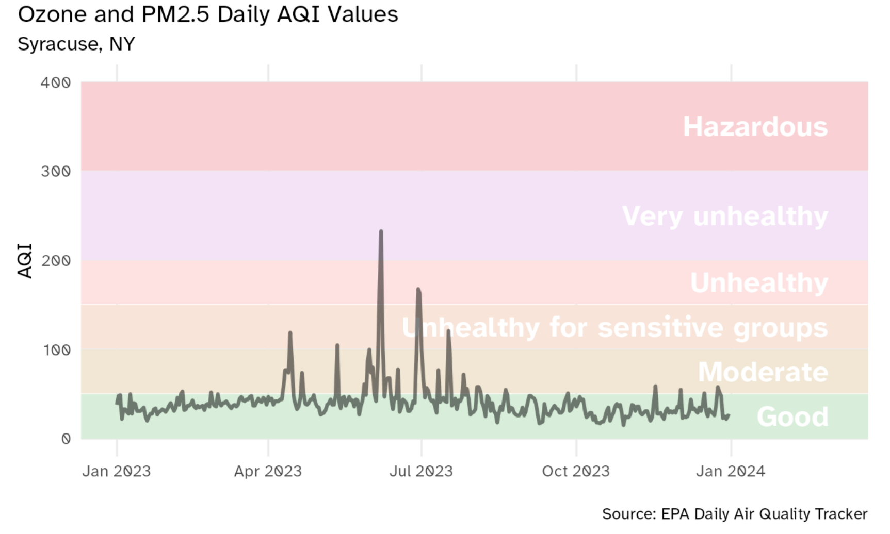
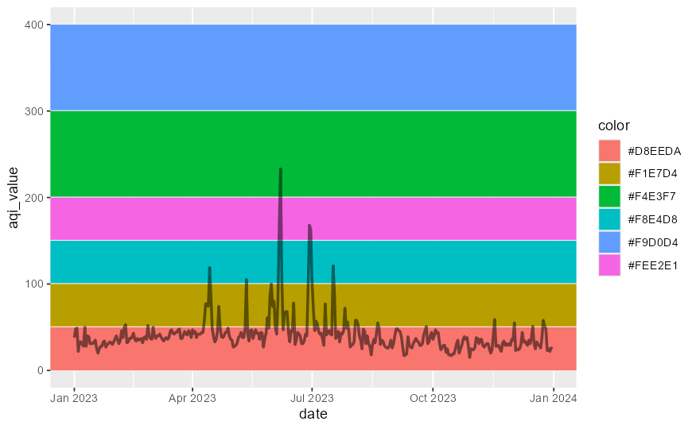
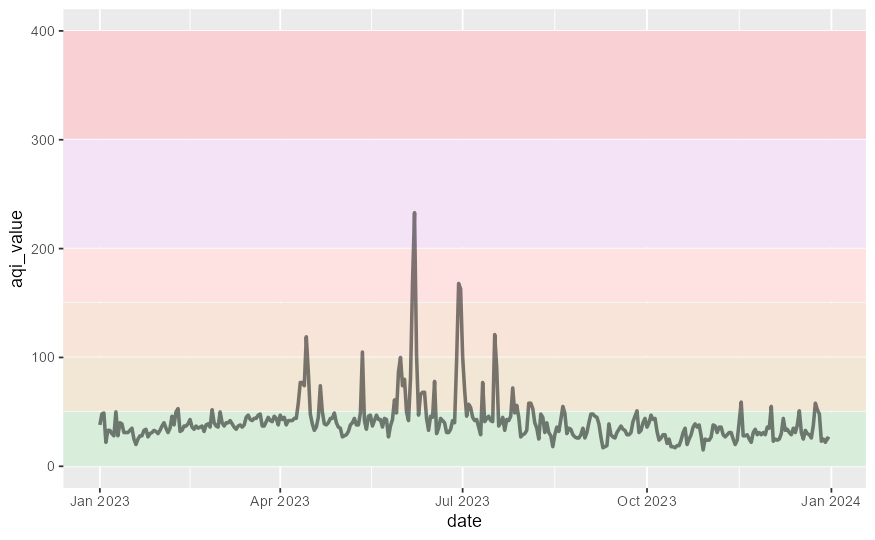
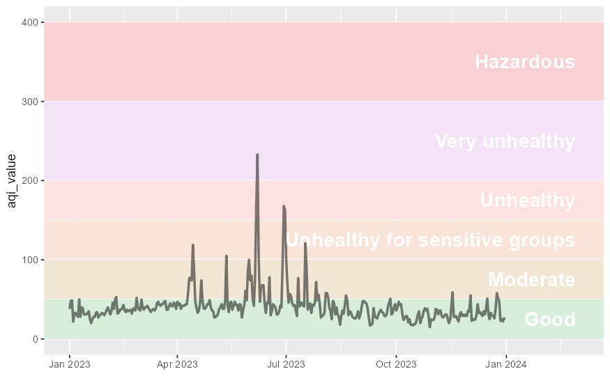
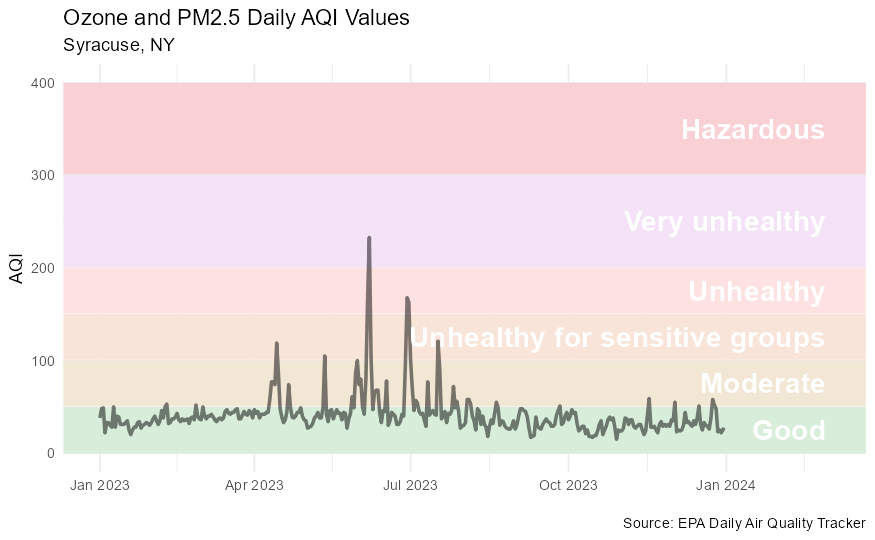
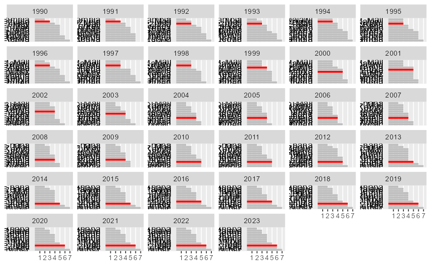
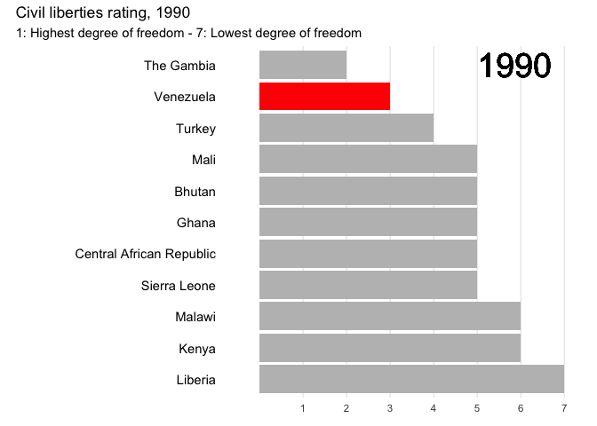

# COMP4010/5120 - Week 13 Application Exercises

---

# A. Application Exercises

**Data:** [`ad_aqi_tracker_data-2023.csv`](./ad_aqi_tracker_data-2023.csv), [`freedom.csv`](./freedom.csv)

```R
library(tidyverse)
library(scales)
library(janitor)
library(colorspace)

#install.packages('gganimate')
library(gganimate)

aqi_levels <- tribble(
  ~aqi_min, ~aqi_max, ~color,    ~level,
  0,        50,       "#D8EEDA", "Good",
  51,       100,      "#F1E7D4", "Moderate",
  101,      150,      "#F8E4D8", "Unhealthy for sensitive groups",
  151,      200,      "#FEE2E1", "Unhealthy",
  201,      300,      "#F4E3F7", "Very unhealthy",
  301,      400,      "#F9D0D4", "Hazardous"
)

freedom <- read_csv(
  file = "freedom.csv",
  na = "-"
)

syr_2023 <- read_csv(file = "ad_aqi_tracker_data-2023.csv")

syr_2023 <- syr_2023 |>
  clean_names() |>
  mutate(date = mdy(date))
```
---

First, we would like to recreate this plot:



Initially, our plot looks like this:

```R
syr_2023 |>
  ggplot(aes(x = date, y = aqi_value, group = 1)) +
  # plot the AQI in Syracuse
  geom_line(linewidth = 1, alpha = 0.5)
```

## Task 1. Add color shading to the plot based on the AQI guide. The color palette does not need to match the specific colors in the table yet.



## Task 2. Use the hexidecimal colors from the dataset for the color palette.



## Task 3. Label each AQI category on the chart

Incorporate text labels for each AQI value directly into the graph. To accomplish this, you need to:

- Calculate the midpoint AQI value for each category
- Add a geom_text() layer to the plot with the AQI values positioned at the midpoint on the y-axis

Extend the range of the x-axis to provide more horizontal space for the AQI category labels without interfering with the trend line.



# Task 4. Clean up the plot.

Add a meaningful title, axis labels, caption, etc.



---

From this task we will be using the `freedom.csv` data to practice animating a bar chart with `gganimate`.

Here is the data we will be using:

```{r}
freedom_to_plot <- freedom |>
  # calculate rowwise standard deviations (one row per country)
  rowwise() |>
  mutate(sd = sd(c_across(contains("cl_")), na.rm = TRUE)) |>
  ungroup() |>
  # find the 15 countries with the highest standard deviations
  relocate(country, sd) |>
  slice_max(order_by = sd, n = 15) |>
  # only keep countries with complete observations - necessary for future plotting
  drop_na()
freedom_to_plot
```

```{r}
# calculate position rankings rather than raw scores
freedom_ranked <- freedom_to_plot |>
  # only keep columns with civil liberties scores
  select(country, contains("cl_")) |>
  # wrangle the data to a long format
  pivot_longer(
    cols = -country,
    names_to = "year",
    values_to = "civil_liberty",
    names_prefix = "cl_",
    names_transform = list(year = as.numeric)
  ) |>
  # calculate rank within year - larger is worse, so reverse in the ranking
  group_by(year) |>
  mutate(rank_in_year = rank(-civil_liberty, ties.method = "first")) |>
  ungroup() |>
  # highlight Venezuela
  mutate(is_venezuela = if_else(country == "Venezuela", TRUE, FALSE))
freedom_ranked
```
## Task 5. Fill in the code given to create a faceted bar plot by year.



## Task 6. Fill in the code given to turn the facet plot into an animation showing the data by year.


```{r}
# smoother transition - might take a while to render
animate(freedom_bar_race, nframes = 300, fps = 100, start_pause = 10, end_pause = 10)
```

